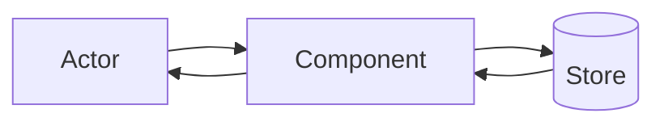

# Architecture — <app>

> **How to read:** components (what the pieces are) → flows (how a request moves
> through them) → Boundaries (where data crosses into something we don't fully
> control). Business language + Mermaid; technical enough to matter, without the
> low-level mechanism.

## Components

<!-- guidance: each major piece + its one job. One line each. -->

- **<Component>** — <its one job>.
- **<Component>** — <…>.

## Flows

<!-- guidance: each named flow = one Mermaid diagram (flowchart or
     sequenceDiagram) + 2-3 lines of prose. Cover the flows that matter, not
     every code path. -->

### <Flow name, e.g. "A normal request">

<2-3 lines: what happens, and anything technical that matters to the operator
(e.g. "the response streams token-by-token").>

## Boundaries

<!-- guidance: a boundary is any place data crosses into a subsystem we don't
     fully control — an LLM prompt, an external API request, a generated query,
     a serialized event. For each: what goes in, in what order, what's injected
     vs static, and what's trusted vs escaped. Prefer ONE annotated REAL example
     over abstract prose. -->

### <Boundary name, e.g. "The model prompt">

<What is sent, and how it's assembled. If it's an LLM boundary, be explicit
about what goes in the system prompt vs the first message vs each later
message, and what gets injected per turn. Show a real, annotated example.>
