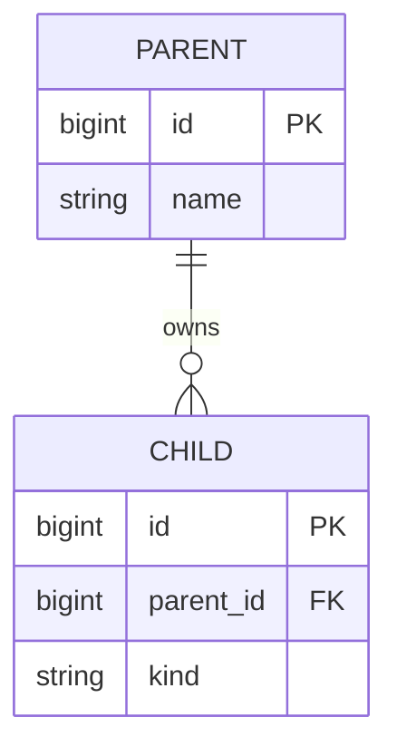

# Data model — <app>

> **How to read:** the **Tables** and **Invariants** below are the summary you
> read first; the **Diagram** at the end is the exact, extensive picture — every
> table, every field, every type. Read top-down for the gist, drop to the
> diagram when you need the precise shape.

<!-- guidance: keep this doc honest with a schema-match test where practical.
     When the test fails, decide which is wrong: the doc (design changed) or the
     code (it drifted). -->

## Tables (the nouns)

<!-- guidance: a short paragraph per table, in business language — what it
     represents and what it owns / relates to. A few lines each is right; not
     one-liners, not essays. Group related tables if it helps. -->

- **<Table>** — <what it represents; what it owns or relates to>.
- **<Table>** — <…>.

## Invariants

<!-- guidance: only the non-obvious rules that the schema alone does NOT reveal —
     the things a reader would get wrong from the column list. -->

- <e.g. "Coin lives in dedicated character columns, never as an inventory item.">
- <…>

## JSON columns

<!-- guidance: for EVERY column that stores JSON, document exactly what goes
     inside, with a concrete example. This is invisible in the schema and is
     exactly where readers get lost. Omit this section only if there are none. -->

- **`<table>.<column>`** — <what it holds, and when it's set>. Example:
  ```json
  { "...": "..." }
  ```

## Diagram

<!-- guidance: ONE erDiagram covering the whole schema — every table, every
     field WITH its type, and the relationships between them. This is meant to
     be large; that is fine and expected. Use PK/FK markers. -->


